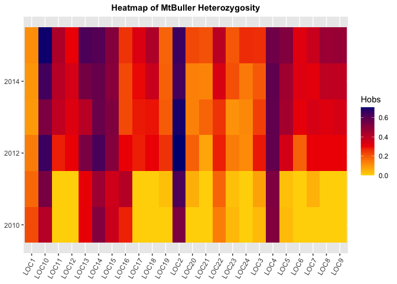

## Library Imports

```r
#install.packages("adegenet")
library(adegenet)
library(ggplot2)
library(tidyverse)
library(here)
library(janitor)
library("gapminder")
library(data.table)
library(shiny)
library(shinydashboard)
```

## Import Dataset


```r
week_gene <- read.csv("data/weeks_genotypes.csv")
head(week_gene)
```

```
##   ID      Pop Year    LOC1    LOC2    LOC3    LOC4    LOC5    LOC6    LOC7
## 1  1 MtBuller 2010 311/311 245/249 303/303 195/201 218/218 211/211 321/321
## 2  2 MtBuller 2010 311/311 245/249 303/303 195/201 218/218 211/211 321/321
## 3  3 MtBuller 2010 311/311 245/249 303/303   NA/NA 218/218 211/211 321/321
## 4  4 MtBuller 2010 311/311 249/249 303/303 195/195 218/218 211/211 321/321
## 5  5 MtBuller 2010 309/311 249/249 303/303 195/201 218/218 211/211 321/321
## 6  6 MtBuller 2010 309/311   NA/NA 303/303 201/201 218/218 211/211 321/321
##      LOC8    LOC9   LOC10   LOC11   LOC12   LOC13   LOC14   LOC15   LOC16
## 1 240/240 157/157 113/113 178/178 125/125 309/318 119/119 144/146 214/214
## 2 240/240 157/157 113/113 178/178 125/125 309/309 119/148 144/146 214/214
## 3 240/240 157/157 113/113 178/178 125/125 309/309 119/119 144/144 214/216
## 4 240/240 157/157 113/113 178/178 125/125 309/309 119/119 144/146 214/214
## 5 240/240 157/157 113/115 178/178 125/125 309/318 148/148 144/146 216/216
## 6 240/240 157/157 113/115 178/178 125/125 309/318 119/148 144/144 214/214
##     LOC17   LOC18   LOC19   LOC20   LOC21   LOC22   LOC23   LOC24
## 1 241/241 160/160 150/150 117/117 141/141 137/137 157/157 177/177
## 2 241/241 160/160 150/150 117/117 141/141 137/137 157/157 177/177
## 3 241/241 160/160 150/150 117/117 141/141 137/137 157/157 177/177
## 4 241/241 160/160 150/150 117/117 141/141 137/137 157/157 177/177
## 5 241/241 160/160 150/150 117/117 141/141 137/141 157/157 177/177
## 6 241/241 160/160 150/150 117/117 141/141 137/137 157/157 177/177
```

## Determine Heterozygosity


```r
alleles <- week_gene[,4:ncol(week_gene)]
genind_alleles <- df2genind(alleles,sep="/",NA.char="NA/NA")
heterozygosity_results <- summary(genind_alleles)
heterozygosity_results
```

```
## 
## // Number of individuals: 524
## // Group sizes: 524
## // Number of alleles per locus: 5 5 10 7 8 3 7 16 3 11 10 2 6 10 5 2 10 2 5 3 2 10 9 4
## // Number of alleles per group: 155
## // Percentage of missing data: 1.03 %
## // Observed heterozygosity: 0.12 0.68 0.29 0.6 0.48 0.3 0.36 0.38 0.35 0.64 0.43 0.22 0.54 0.6 0.5 0.21 0.38 0.25 0.25 0.17 0.17 0.39 0.26 0.25
## // Expected heterozygosity: 0.12 0.64 0.36 0.7 0.58 0.32 0.5 0.56 0.51 0.74 0.56 0.45 0.64 0.61 0.63 0.25 0.44 0.46 0.29 0.19 0.35 0.49 0.33 0.38
```

## Heterozygosity by Population

```r
pop_geind_alleles <- seppop(df2genind(alleles,sep="/",NA.char="NA/NA", pop=week_gene$Pop))
pop_geind_alleles
```

```
## $MtBuller
## /// GENIND OBJECT /////////
## 
##  // 420 individuals; 24 loci; 155 alleles; size: 316.4 Kb
## 
##  // Basic content
##    @tab:  420 x 155 matrix of allele counts
##    @loc.n.all: number of alleles per locus (range: 2-16)
##    @loc.fac: locus factor for the 155 columns of @tab
##    @all.names: list of allele names for each locus
##    @ploidy: ploidy of each individual  (range: 2-2)
##    @type:  codom
##    @call: .local(x = x, i = i, j = j, pop = ..1, treatOther = ..2, quiet = ..3, 
##     drop = drop)
## 
##  // Optional content
##    @pop: population of each individual (group size range: 420-420)
## 
## $MtHigginbotham
## /// GENIND OBJECT /////////
## 
##  // 104 individuals; 24 loci; 155 alleles; size: 102.9 Kb
## 
##  // Basic content
##    @tab:  104 x 155 matrix of allele counts
##    @loc.n.all: number of alleles per locus (range: 2-16)
##    @loc.fac: locus factor for the 155 columns of @tab
##    @all.names: list of allele names for each locus
##    @ploidy: ploidy of each individual  (range: 2-2)
##    @type:  codom
##    @call: .local(x = x, i = i, j = j, pop = ..1, treatOther = ..2, quiet = ..3, 
##     drop = drop)
## 
##  // Optional content
##    @pop: population of each individual (group size range: 104-104)
```

## Group by Population

```r
MtBuller <- summary(pop_geind_alleles$MtBuller)
MtHiggenbotham <- summary(pop_geind_alleles$MtHigginbotham)
MtBuller
```

```
## 
## // Number of individuals: 420
## // Group sizes: 420
## // Number of alleles per locus: 4 4 4 7 7 2 6 10 3 7 8 2 5 5 5 2 6 2 4 3 2 9 5 4
## // Number of alleles per group: 116
## // Percentage of missing data: 0.64 %
## // Observed heterozygosity: 0.12 0.65 0.21 0.56 0.39 0.26 0.29 0.33 0.34 0.62 0.33 0.27 0.51 0.58 0.49 0.26 0.26 0.31 0.17 0.15 0.14 0.31 0.16 0.15
## // Expected heterozygosity: 0.11 0.61 0.23 0.61 0.4 0.25 0.29 0.36 0.34 0.64 0.34 0.3 0.51 0.57 0.51 0.3 0.26 0.33 0.16 0.18 0.16 0.35 0.16 0.17
```

## Create dataframes for comparing observed and expected

```r
MtBullerDf <- data.frame(unlist(MtBuller$Hobs), unlist(MtBuller$Hexp))
names(MtBullerDf) <- c("Hobs", "Hexp")
MtHiggenbothamDf <- data.frame(unlist(MtHiggenbotham$Hobs), unlist(MtHiggenbotham$Hexp))
names(MtHiggenbothamDf) <- c("Hobs", "Hexp")
head(MtBullerDf)
```

```
##           Hobs      Hexp
## LOC1 0.1196172 0.1129982
## LOC2 0.6526055 0.6064596
## LOC3 0.2120482 0.2329279
## LOC4 0.5649038 0.6085111
## LOC5 0.3937947 0.4022334
## LOC6 0.2583732 0.2458735
```

## Dataframes Pivoted on Observation Type

```r
category <- rep(c("Observed", "Expected"), each=length(MtBullerDf$Hobs))
MtBullerPivot <- data.frame(c(seq(1, 24, 1), seq(1, 24, 1)), c(MtBullerDf$Hobs, MtBullerDf$Hexp), category)
MtHiggenbothamPivot <- data.frame(c(seq(1, 24, 1), seq(1, 24, 1)), c(MtHiggenbothamDf$Hobs, MtHiggenbothamDf$Hexp), category)
names(MtBullerPivot) <- c("Location", "Heterozygosity", "Type")
names(MtHiggenbothamPivot) <- c("Location", "Heterozygosity", "Type")
head(MtBullerPivot)
```

```
##   Location Heterozygosity     Type
## 1        1      0.1196172 Observed
## 2        2      0.6526055 Observed
## 3        3      0.2120482 Observed
## 4        4      0.5649038 Observed
## 5        5      0.3937947 Observed
## 6        6      0.2583732 Observed
```

## Boxplot Comparison MtBuller

```r
MtBullerPivot %>% 
  ggplot(aes(x=Type, y=Heterozygosity, fill=Type))+
  geom_boxplot(color="grey", alpha=0.8, na.rm = TRUE)+
  geom_violin(alpha=0.5, na.rm = TRUE)+
  scale_fill_brewer(palette = "Pastel1")+
  theme(plot.title = element_text(size = rel(1), face='bold', hjust = 0.5)) +
  labs(title = "MtBuller Observation Type and Heterozygosity",
       x="Type",
       y="Heterozygosity")
```

<!-- -->

## Boxplot Comparison MtHiggenbotham

```r
MtHiggenbothamPivot %>% 
  #mutate(Heterozygosity=as.factor(Heterozygosity)) %>% 
  ggplot(aes(x=Type, y=Heterozygosity, fill=Type))+
  geom_boxplot(color="grey", alpha=0.8, na.rm = TRUE)+
  geom_violin(alpha=0.5, na.rm = TRUE)+
  scale_fill_brewer(palette = "Pastel1")+
  theme(plot.title = element_text(size = rel(1), face='bold', hjust = 0.5)) +
  labs(title = "MtHiggenbotham Observation Type and Heterozygosity",
       x="Type",
       y="Heterozygosity")
```

<!-- -->

## Barplot Comparison MtBuller

```r
MtBullerPivot %>%
  ggplot(aes(x=Location, y=Heterozygosity, fill=Type)) + geom_bar(stat="identity", position = "identity", alpha=.3, na.rm=T)
```

<!-- -->

## Barplot Comparison MtHiggenbotham

```r
MtHiggenbothamPivot %>%
  ggplot(aes(x=Location, y=Heterozygosity, fill=Type)) + geom_bar(stat="identity", position = "identity", alpha=.3, na.rm=T)
```

<!-- -->

## Scatterplot Comparison of Observed between MtBuller and MtHiggenbotham

```r
combindedPop <- rbind(MtBullerDf, MtHiggenbothamDf)
combindedPop$Population <- rep(c("MtBuller", "MtHiggenbotham"), each=24)
combindedPop$Location <- c(seq(1, 24, 1), seq(1, 24, 1))
combindedPop %>% 
  ggplot(aes(x=Location, y=Hobs, color=Population)) + geom_point()
```

<!-- -->

## Scatterplot Comparison of Expected between MtBuller and MtHiggenbotham

```r
combindedPop %>% 
  ggplot(aes(x=Location, y=Hexp, color=Population)) + geom_point()
```

<!-- -->

## Top 5 Microsatellite Loci with Higher than Expected Heterozygosity (MtBuller)

```r
MtBullerDf %>%
  mutate(Hdiff= Hobs - Hexp) %>%
  arrange(desc(Hdiff))
```

```
##            Hobs      Hexp         Hdiff
## LOC2  0.6526055 0.6064596  0.0461458417
## LOC6  0.2583732 0.2458735  0.0124997138
## LOC1  0.1196172 0.1129982  0.0066190106
## LOC7  0.2911695 0.2869544  0.0042150592
## LOC14 0.5751790 0.5734332  0.0017458319
## LOC19 0.1654676 0.1647056  0.0007619803
## LOC9  0.3381295 0.3399151 -0.0017856219
## LOC13 0.5083532 0.5145363 -0.0061830361
## LOC23 0.1558753 0.1637021 -0.0078268321
## LOC17 0.2559809 0.2639076 -0.0079267874
## LOC5  0.3937947 0.4022334 -0.0084386623
## LOC11 0.3317422 0.3431457 -0.0114034438
## LOC10 0.6201923 0.6384350 -0.0182426498
## LOC15 0.4892086 0.5079217 -0.0187130871
## LOC18 0.3086124 0.3282291 -0.0196166525
## LOC24 0.1531100 0.1735194 -0.0204093313
## LOC3  0.2120482 0.2329279 -0.0208796632
## LOC20 0.1527446 0.1750275 -0.0222828533
## LOC8  0.3325359 0.3583595 -0.0258235846
## LOC21 0.1360382 0.1629775 -0.0269393544
## LOC12 0.2696897 0.3045010 -0.0348112622
## LOC22 0.3110048 0.3484438 -0.0374390467
## LOC16 0.2625298 0.3030058 -0.0404759599
## LOC4  0.5649038 0.6085111 -0.0436072716
```


```r
MtBullerPivot %>%
  filter(Location %in% c("2","6","1","7","14")) %>%
  ggplot(aes(x=Type, y = Heterozygosity, fill = Type))+ 
  geom_col(alpha=0.8)+
  facet_grid(.~Location)+
  theme(axis.text.x = element_text(angle = 60, hjust = 1)) +
  theme(plot.title = element_text(size = rel(1), face='bold', hjust = 0.5)) +
  labs(title = "Top 5 Microsatellite Loci with Higher than Expected Heterozygosity (MtBuller)",
       x="Type",
       y="Heterozygosity")
```

<!-- -->

## Top 5 Microsatellite Loci with Higher than Expected Heterozygosity (MtHiggenbotham)

```r
MtHiggenbothamDf %>%
  mutate(Hdiff= Hobs - Hexp) %>%
  arrange(desc(Hdiff))
```

```
##             Hobs      Hexp        Hdiff
## LOC2  0.79797980 0.7299765  0.068003265
## LOC17 0.85576923 0.7887389  0.067030325
## LOC5  0.82692308 0.7842086  0.042714497
## LOC9  0.40384615 0.3651997  0.038646450
## LOC4  0.74226804 0.7111276  0.031140397
## LOC7  0.61538462 0.5889885  0.026396080
## LOC11 0.86000000 0.8387000  0.021300000
## LOC14 0.68269231 0.6661890  0.016503328
## LOC19 0.59595960 0.5951944  0.000765228
## LOC12 0.00000000 0.0000000  0.000000000
## LOC16 0.00000000 0.0000000  0.000000000
## LOC18 0.00000000 0.0000000  0.000000000
## LOC20 0.25961538 0.2669656 -0.007350222
## LOC10 0.71287129 0.7211548 -0.008283502
## LOC13 0.66666667 0.7004998 -0.033833141
## LOC1  0.09473684 0.1304709 -0.035734072
## LOC6  0.46000000 0.4994500 -0.039450000
## LOC15 0.53921569 0.5977989 -0.058583237
## LOC24 0.65384615 0.7141734 -0.060327293
## LOC23 0.67000000 0.7308000 -0.060800000
## LOC21 0.30097087 0.3625695 -0.061598643
## LOC3  0.64516129 0.7119320 -0.066770725
## LOC22 0.68269231 0.8031158 -0.120423447
## LOC8  0.56250000 0.8789605 -0.316460503
```

```r
MtHiggenbothamPivot %>%
  filter(Location %in% c("2","17","5","9","4")) %>%
  ggplot(aes(x=Type, y = Heterozygosity, fill = Type))+ 
  geom_col(alpha=0.8)+
  facet_grid(.~Location)+
  theme(axis.text.x = element_text(angle = 60, hjust = 1)) +
  theme(plot.title = element_text(size = rel(1), face='bold', hjust = 0.5)) +
  labs(title = "Top 5 Microsatellite Loci with Higher than Expected Heterozygosity (MtHiggenbotham)",
       x="Type",
       y="Heterozygosity")
```

<!-- -->

# Most Heterozygous Locus

```r
MtBullerDf %>%
  mutate(Heteroz = abs(Hobs - 0.5)) %>%
  arrange(Heteroz)
```

```
##            Hobs      Hexp     Heteroz
## LOC13 0.5083532 0.5145363 0.008353222
## LOC15 0.4892086 0.5079217 0.010791367
## LOC4  0.5649038 0.6085111 0.064903846
## LOC14 0.5751790 0.5734332 0.075178998
## LOC5  0.3937947 0.4022334 0.106205251
## LOC10 0.6201923 0.6384350 0.120192308
## LOC2  0.6526055 0.6064596 0.152605459
## LOC9  0.3381295 0.3399151 0.161870504
## LOC8  0.3325359 0.3583595 0.167464115
## LOC11 0.3317422 0.3431457 0.168257757
## LOC22 0.3110048 0.3484438 0.188995215
## LOC18 0.3086124 0.3282291 0.191387560
## LOC7  0.2911695 0.2869544 0.208830549
## LOC12 0.2696897 0.3045010 0.230310263
## LOC16 0.2625298 0.3030058 0.237470167
## LOC6  0.2583732 0.2458735 0.241626794
## LOC17 0.2559809 0.2639076 0.244019139
## LOC3  0.2120482 0.2329279 0.287951807
## LOC19 0.1654676 0.1647056 0.334532374
## LOC23 0.1558753 0.1637021 0.344124700
## LOC24 0.1531100 0.1735194 0.346889952
## LOC20 0.1527446 0.1750275 0.347255370
## LOC21 0.1360382 0.1629775 0.363961814
## LOC1  0.1196172 0.1129982 0.380382775
```

```r
MtHiggenbothamDf %>%
  mutate(Heteroz = abs(Hobs - 0.5)) %>%
  arrange(Heteroz)
```

```
##             Hobs      Hexp    Heteroz
## LOC15 0.53921569 0.5977989 0.03921569
## LOC6  0.46000000 0.4994500 0.04000000
## LOC8  0.56250000 0.8789605 0.06250000
## LOC19 0.59595960 0.5951944 0.09595960
## LOC9  0.40384615 0.3651997 0.09615385
## LOC7  0.61538462 0.5889885 0.11538462
## LOC3  0.64516129 0.7119320 0.14516129
## LOC24 0.65384615 0.7141734 0.15384615
## LOC13 0.66666667 0.7004998 0.16666667
## LOC23 0.67000000 0.7308000 0.17000000
## LOC14 0.68269231 0.6661890 0.18269231
## LOC22 0.68269231 0.8031158 0.18269231
## LOC21 0.30097087 0.3625695 0.19902913
## LOC10 0.71287129 0.7211548 0.21287129
## LOC20 0.25961538 0.2669656 0.24038462
## LOC4  0.74226804 0.7111276 0.24226804
## LOC2  0.79797980 0.7299765 0.29797980
## LOC5  0.82692308 0.7842086 0.32692308
## LOC17 0.85576923 0.7887389 0.35576923
## LOC11 0.86000000 0.8387000 0.36000000
## LOC1  0.09473684 0.1304709 0.40526316
## LOC12 0.00000000 0.0000000 0.50000000
## LOC16 0.00000000 0.0000000 0.50000000
## LOC18 0.00000000 0.0000000 0.50000000
```
## How many samples do you have from each year?

```r
week_gene%>%
  filter(Pop == "MtBuller")%>%
  mutate(Year=as.factor(Year))%>%
  count(Year)
```

```
##   Year   n
## 1 2010  29
## 2 2011  40
## 3 2012  43
## 4 2013  67
## 5 2014 103
## 6 2015 138
```
## Further Data Cleaning 
Mt Buller Heterozygosity in 2010.

```r
week_gene_mtbuller <- filter(week_gene,Pop=="MtBuller")
week_gene_2010 <- filter(week_gene_mtbuller,Year==2010)
alleles_2010 <- week_gene_2010[,4:ncol(week_gene)]
pop_geind_alleles_2010 <- seppop(df2genind(alleles_2010,sep="/",NA.char="NA/NA", pop=week_gene_2010$Pop))
MtBuller_2010 <- summary(pop_geind_alleles_2010$MtBuller)
MtBullerDf_2010 <- data.frame(unlist(MtBuller_2010$Hobs), unlist(MtBuller_2010$Hexp))
names(MtBullerDf_2010) <- c("Hobs", "Hexp")
MtBullerDf_2010 <- tibble::rownames_to_column(MtBullerDf_2010, "Locus")
year2010<-rep(2010,times=24)
MtBullerDf_2010$Year <- year2010
MtBullerDf_2010
```

```
##    Locus       Hobs       Hexp Year
## 1   LOC1 0.22222222 0.19753086 2010
## 2   LOC2 0.52631579 0.49861496 2010
## 3   LOC3 0.03571429 0.03507653 2010
## 4   LOC4 0.51851852 0.51371742 2010
## 5   LOC5 0.03448276 0.03388823 2010
## 6   LOC6 0.00000000 0.00000000 2010
## 7   LOC7 0.00000000 0.00000000 2010
## 8   LOC8 0.00000000 0.00000000 2010
## 9   LOC9 0.00000000 0.00000000 2010
## 10 LOC10 0.40740741 0.36556927 2010
## 11 LOC11 0.00000000 0.00000000 2010
## 12 LOC12 0.00000000 0.00000000 2010
## 13 LOC13 0.31034483 0.26218787 2010
## 14 LOC14 0.51724138 0.49762188 2010
## 15 LOC15 0.37037037 0.34567901 2010
## 16 LOC16 0.27586207 0.36623068 2010
## 17 LOC17 0.00000000 0.00000000 2010
## 18 LOC18 0.00000000 0.00000000 2010
## 19 LOC19 0.00000000 0.00000000 2010
## 20 LOC20 0.00000000 0.00000000 2010
## 21 LOC21 0.00000000 0.00000000 2010
## 22 LOC22 0.13793103 0.13020214 2010
## 23 LOC23 0.03703704 0.03635117 2010
## 24 LOC24 0.00000000 0.00000000 2010
```
Mt Buller Heterozygosity in 2011.

```r
week_gene_2011 <- filter(week_gene_mtbuller,Year==2011)
alleles_2011 <- week_gene_2011[,4:ncol(week_gene)]
pop_geind_alleles_2011 <- seppop(df2genind(alleles_2011,sep="/",NA.char="NA/NA", pop=week_gene_2011$Pop))
MtBuller_2011 <- summary(pop_geind_alleles_2011$MtBuller)
MtBullerDf_2011 <- data.frame(unlist(MtBuller_2011$Hobs), unlist(MtBuller_2011$Hexp))
names(MtBullerDf_2011) <- c("Hobs", "Hexp")
MtBullerDf_2011 <- tibble::rownames_to_column(MtBullerDf_2011, "Locus")
year2011<-rep(2011,times=24)
MtBullerDf_2011$Year <- year2011
MtBullerDf_2011
```

```
##    Locus       Hobs       Hexp Year
## 1   LOC1 0.17500000 0.15968750 2011
## 2   LOC2 0.62162162 0.50000000 2011
## 3   LOC3 0.07692308 0.07396450 2011
## 4   LOC4 0.52500000 0.48468750 2011
## 5   LOC5 0.02500000 0.02468750 2011
## 6   LOC6 0.00000000 0.00000000 2011
## 7   LOC7 0.05000000 0.04875000 2011
## 8   LOC8 0.00000000 0.00000000 2011
## 9   LOC9 0.00000000 0.00000000 2011
## 10 LOC10 0.53846154 0.49474030 2011
## 11 LOC11 0.00000000 0.00000000 2011
## 12 LOC12 0.00000000 0.00000000 2011
## 13 LOC13 0.30769231 0.32610125 2011
## 14 LOC14 0.46153846 0.49704142 2011
## 15 LOC15 0.35897436 0.29454306 2011
## 16 LOC16 0.41025641 0.44444444 2011
## 17 LOC17 0.00000000 0.04996713 2011
## 18 LOC18 0.00000000 0.00000000 2011
## 19 LOC19 0.02564103 0.02531229 2011
## 20 LOC20 0.05128205 0.26397107 2011
## 21 LOC21 0.00000000 0.00000000 2011
## 22 LOC22 0.17948718 0.16337936 2011
## 23 LOC23 0.02564103 0.02531229 2011
## 24 LOC24 0.00000000 0.00000000 2011
```
Mt Buller Heterozygosity in 2012.

```r
week_gene_2012 <- filter(week_gene_mtbuller,Year==2012)
alleles_2012 <- week_gene_2012[,4:ncol(week_gene)]
pop_geind_alleles_2012 <- seppop(df2genind(alleles_2012,sep="/",NA.char="NA/NA", pop=week_gene_2012$Pop))
MtBuller_2012 <- summary(pop_geind_alleles_2012$MtBuller)
MtBullerDf_2012 <- data.frame(unlist(MtBuller_2012$Hobs), unlist(MtBuller_2012$Hexp))
names(MtBullerDf_2012) <- c("Hobs", "Hexp")
MtBullerDf_2012 <- tibble::rownames_to_column(MtBullerDf_2012, "Locus")
year2012<-rep(2012,times=24)
MtBullerDf_2012$Year <- year2012
MtBullerDf_2012
```

```
##    Locus       Hobs       Hexp Year
## 1   LOC1 0.13953488 0.12979989 2012
## 2   LOC2 0.70731707 0.59399167 2012
## 3   LOC3 0.28571429 0.25821995 2012
## 4   LOC4 0.58139535 0.57193077 2012
## 5   LOC5 0.34883721 0.30665224 2012
## 6   LOC6 0.18604651 0.16873986 2012
## 7   LOC7 0.30232558 0.26744186 2012
## 8   LOC8 0.30232558 0.27203894 2012
## 9   LOC9 0.30232558 0.26473770 2012
## 10 LOC10 0.65116279 0.61898323 2012
## 11 LOC11 0.27906977 0.29150892 2012
## 12 LOC12 0.30232558 0.25662520 2012
## 13 LOC13 0.53488372 0.50676041 2012
## 14 LOC14 0.62790698 0.55246079 2012
## 15 LOC15 0.51162791 0.44104922 2012
## 16 LOC16 0.30232558 0.31719849 2012
## 17 LOC17 0.27906977 0.28637101 2012
## 18 LOC18 0.30232558 0.25662520 2012
## 19 LOC19 0.25581395 0.22579773 2012
## 20 LOC20 0.18604651 0.17063277 2012
## 21 LOC21 0.06976744 0.06733369 2012
## 22 LOC22 0.27906977 0.27257977 2012
## 23 LOC23 0.13953488 0.13223364 2012
## 24 LOC24 0.11627907 0.11060032 2012
```
Mt Buller Heterozygosity in 2013.

```r
week_gene_2013 <- filter(week_gene_mtbuller,Year==2013)
alleles_2013 <- week_gene_2013[,4:ncol(week_gene)]
pop_geind_alleles_2013 <- seppop(df2genind(alleles_2013,sep="/",NA.char="NA/NA", pop=week_gene_2013$Pop))
MtBuller_2013 <- summary(pop_geind_alleles_2013$MtBuller)
MtBullerDf_2013 <- data.frame(unlist(MtBuller_2013$Hobs), unlist(MtBuller_2013$Hexp))
names(MtBullerDf_2013) <- c("Hobs", "Hexp")
MtBullerDf_2013 <- tibble::rownames_to_column(MtBullerDf_2013, "Locus")
year2013<-rep(2013,times=24)
MtBullerDf_2013$Year <- year2013
MtBullerDf_2013
```

```
##    Locus       Hobs       Hexp Year
## 1   LOC1 0.08955224 0.08554244 2013
## 2   LOC2 0.69696970 0.61994949 2013
## 3   LOC3 0.23880597 0.27756739 2013
## 4   LOC4 0.58208955 0.61784362 2013
## 5   LOC5 0.44776119 0.40064602 2013
## 6   LOC6 0.31343284 0.26431276 2013
## 7   LOC7 0.34328358 0.30964580 2013
## 8   LOC8 0.32835821 0.34551125 2013
## 9   LOC9 0.34328358 0.30730675 2013
## 10 LOC10 0.53030303 0.59882920 2013
## 11 LOC11 0.38805970 0.36400089 2013
## 12 LOC12 0.32835821 0.29405213 2013
## 13 LOC13 0.40298507 0.43294720 2013
## 14 LOC14 0.56716418 0.54811762 2013
## 15 LOC15 0.52238806 0.50879929 2013
## 16 LOC16 0.22388060 0.26431276 2013
## 17 LOC17 0.28358209 0.28959679 2013
## 18 LOC18 0.28787879 0.26756198 2013
## 19 LOC19 0.19402985 0.20037870 2013
## 20 LOC20 0.13432836 0.12530630 2013
## 21 LOC21 0.17910448 0.16306527 2013
## 22 LOC22 0.25373134 0.23357095 2013
## 23 LOC23 0.10447761 0.10035643 2013
## 24 LOC24 0.11940299 0.16540432 2013
```
Mt Buller Heterozygosity in 2014.

```r
week_gene_2014 <- filter(week_gene_mtbuller,Year==2014)
alleles_2014 <- week_gene_2014[,4:ncol(week_gene)]
pop_geind_alleles_2014 <- seppop(df2genind(alleles_2014,sep="/",NA.char="NA/NA", pop=week_gene_2014$Pop))
MtBuller_2014 <- summary(pop_geind_alleles_2014$MtBuller)
MtBullerDf_2014 <- data.frame(unlist(MtBuller_2014$Hobs), unlist(MtBuller_2014$Hexp))
names(MtBullerDf_2014) <- c("Hobs", "Hexp")
MtBullerDf_2014 <- tibble::rownames_to_column(MtBullerDf_2014, "Locus")
year2014<-rep(2014,times=24)
MtBullerDf_2014$Year <- year2014
MtBullerDf_2014
```

```
##    Locus       Hobs       Hexp Year
## 1   LOC1 0.09708738 0.09279857 2014
## 2   LOC2 0.63725490 0.61385044 2014
## 3   LOC3 0.19801980 0.20919518 2014
## 4   LOC4 0.58823529 0.62336601 2014
## 5   LOC5 0.45631068 0.44900556 2014
## 6   LOC6 0.33009709 0.31294184 2014
## 7   LOC7 0.32038835 0.29555095 2014
## 8   LOC8 0.39215686 0.39609765 2014
## 9   LOC9 0.38834951 0.35012725 2014
## 10 LOC10 0.64077670 0.66410595 2014
## 11 LOC11 0.40776699 0.37897069 2014
## 12 LOC12 0.34951456 0.34687529 2014
## 13 LOC13 0.54368932 0.54076727 2014
## 14 LOC14 0.57281553 0.58294844 2014
## 15 LOC15 0.50485437 0.52351777 2014
## 16 LOC16 0.22330097 0.28207183 2014
## 17 LOC17 0.29411765 0.26148597 2014
## 18 LOC18 0.36893204 0.37741540 2014
## 19 LOC19 0.18446602 0.16745216 2014
## 20 LOC20 0.13592233 0.12668489 2014
## 21 LOC21 0.12621359 0.13502686 2014
## 22 LOC22 0.33980583 0.37307946 2014
## 23 LOC23 0.21359223 0.19629560 2014
## 24 LOC24 0.14563107 0.17188236 2014
```
Mt Buller Heterozygosity in 2015.

```r
week_gene_2015 <- filter(week_gene_mtbuller,Year==2015)
alleles_2015 <- week_gene_2015[,4:ncol(week_gene)]
pop_geind_alleles_2015 <- seppop(df2genind(alleles_2015,sep="/",NA.char="NA/NA", pop=week_gene_2015$Pop))
MtBuller_2015 <- summary(pop_geind_alleles_2015$MtBuller)
MtBullerDf_2015 <- data.frame(unlist(MtBuller_2015$Hobs), unlist(MtBuller_2015$Hexp))
names(MtBullerDf_2015) <- c("Hobs", "Hexp")
MtBullerDf_2015 <- tibble::rownames_to_column(MtBullerDf_2015, "Locus")
year2015<-rep(2015,times=24)
MtBullerDf_2015$Year <- year2015
MtBullerDf_2015
```

```
##    Locus      Hobs      Hexp Year
## 1   LOC1 0.1086957 0.1037860 2015
## 2   LOC2 0.6521739 0.6282031 2015
## 3   LOC3 0.2608696 0.2947648 2015
## 4   LOC4 0.5547445 0.6381267 2015
## 5   LOC5 0.5182482 0.5354574 2015
## 6   LOC6 0.3260870 0.3012760 2015
## 7   LOC7 0.3722628 0.3806809 2015
## 8   LOC8 0.4671533 0.5025574 2015
## 9   LOC9 0.4744526 0.4837764 2015
## 10 LOC10 0.7028986 0.6967549 2015
## 11 LOC11 0.4275362 0.4584646 2015
## 12 LOC12 0.3043478 0.3924596 2015
## 13 LOC13 0.6231884 0.6111111 2015
## 14 LOC14 0.6086957 0.6102184 2015
## 15 LOC15 0.5144928 0.5807341 2015
## 16 LOC16 0.2536232 0.2630487 2015
## 17 LOC17 0.3333333 0.3441504 2015
## 18 LOC18 0.4275362 0.4317108 2015
## 19 LOC19 0.1811594 0.1894823 2015
## 20 LOC20 0.2246377 0.2321729 2015
## 21 LOC21 0.2101449 0.2729206 2015
## 22 LOC22 0.4014599 0.4833236 2015
## 23 LOC23 0.2028986 0.2346933 2015
## 24 LOC24 0.2627737 0.2722574 2015
```
## Combined Data for Analysis

```r
MtBuller_Heterozygosity <- rbind(MtBullerDf_2010,MtBullerDf_2011,MtBullerDf_2012,MtBullerDf_2013,MtBullerDf_2014,MtBullerDf_2015)
MtBuller_Heterozygosity
```

```
##     Locus       Hobs       Hexp Year
## 1    LOC1 0.22222222 0.19753086 2010
## 2    LOC2 0.52631579 0.49861496 2010
## 3    LOC3 0.03571429 0.03507653 2010
## 4    LOC4 0.51851852 0.51371742 2010
## 5    LOC5 0.03448276 0.03388823 2010
## 6    LOC6 0.00000000 0.00000000 2010
## 7    LOC7 0.00000000 0.00000000 2010
## 8    LOC8 0.00000000 0.00000000 2010
## 9    LOC9 0.00000000 0.00000000 2010
## 10  LOC10 0.40740741 0.36556927 2010
## 11  LOC11 0.00000000 0.00000000 2010
## 12  LOC12 0.00000000 0.00000000 2010
## 13  LOC13 0.31034483 0.26218787 2010
## 14  LOC14 0.51724138 0.49762188 2010
## 15  LOC15 0.37037037 0.34567901 2010
## 16  LOC16 0.27586207 0.36623068 2010
## 17  LOC17 0.00000000 0.00000000 2010
## 18  LOC18 0.00000000 0.00000000 2010
## 19  LOC19 0.00000000 0.00000000 2010
## 20  LOC20 0.00000000 0.00000000 2010
## 21  LOC21 0.00000000 0.00000000 2010
## 22  LOC22 0.13793103 0.13020214 2010
## 23  LOC23 0.03703704 0.03635117 2010
## 24  LOC24 0.00000000 0.00000000 2010
## 25   LOC1 0.17500000 0.15968750 2011
## 26   LOC2 0.62162162 0.50000000 2011
## 27   LOC3 0.07692308 0.07396450 2011
## 28   LOC4 0.52500000 0.48468750 2011
## 29   LOC5 0.02500000 0.02468750 2011
## 30   LOC6 0.00000000 0.00000000 2011
## 31   LOC7 0.05000000 0.04875000 2011
## 32   LOC8 0.00000000 0.00000000 2011
## 33   LOC9 0.00000000 0.00000000 2011
## 34  LOC10 0.53846154 0.49474030 2011
## 35  LOC11 0.00000000 0.00000000 2011
## 36  LOC12 0.00000000 0.00000000 2011
## 37  LOC13 0.30769231 0.32610125 2011
## 38  LOC14 0.46153846 0.49704142 2011
## 39  LOC15 0.35897436 0.29454306 2011
## 40  LOC16 0.41025641 0.44444444 2011
## 41  LOC17 0.00000000 0.04996713 2011
## 42  LOC18 0.00000000 0.00000000 2011
## 43  LOC19 0.02564103 0.02531229 2011
## 44  LOC20 0.05128205 0.26397107 2011
## 45  LOC21 0.00000000 0.00000000 2011
## 46  LOC22 0.17948718 0.16337936 2011
## 47  LOC23 0.02564103 0.02531229 2011
## 48  LOC24 0.00000000 0.00000000 2011
## 49   LOC1 0.13953488 0.12979989 2012
## 50   LOC2 0.70731707 0.59399167 2012
## 51   LOC3 0.28571429 0.25821995 2012
## 52   LOC4 0.58139535 0.57193077 2012
## 53   LOC5 0.34883721 0.30665224 2012
## 54   LOC6 0.18604651 0.16873986 2012
## 55   LOC7 0.30232558 0.26744186 2012
## 56   LOC8 0.30232558 0.27203894 2012
## 57   LOC9 0.30232558 0.26473770 2012
## 58  LOC10 0.65116279 0.61898323 2012
## 59  LOC11 0.27906977 0.29150892 2012
## 60  LOC12 0.30232558 0.25662520 2012
## 61  LOC13 0.53488372 0.50676041 2012
## 62  LOC14 0.62790698 0.55246079 2012
## 63  LOC15 0.51162791 0.44104922 2012
## 64  LOC16 0.30232558 0.31719849 2012
## 65  LOC17 0.27906977 0.28637101 2012
## 66  LOC18 0.30232558 0.25662520 2012
## 67  LOC19 0.25581395 0.22579773 2012
## 68  LOC20 0.18604651 0.17063277 2012
## 69  LOC21 0.06976744 0.06733369 2012
## 70  LOC22 0.27906977 0.27257977 2012
## 71  LOC23 0.13953488 0.13223364 2012
## 72  LOC24 0.11627907 0.11060032 2012
## 73   LOC1 0.08955224 0.08554244 2013
## 74   LOC2 0.69696970 0.61994949 2013
## 75   LOC3 0.23880597 0.27756739 2013
## 76   LOC4 0.58208955 0.61784362 2013
## 77   LOC5 0.44776119 0.40064602 2013
## 78   LOC6 0.31343284 0.26431276 2013
## 79   LOC7 0.34328358 0.30964580 2013
## 80   LOC8 0.32835821 0.34551125 2013
## 81   LOC9 0.34328358 0.30730675 2013
## 82  LOC10 0.53030303 0.59882920 2013
## 83  LOC11 0.38805970 0.36400089 2013
## 84  LOC12 0.32835821 0.29405213 2013
## 85  LOC13 0.40298507 0.43294720 2013
## 86  LOC14 0.56716418 0.54811762 2013
## 87  LOC15 0.52238806 0.50879929 2013
## 88  LOC16 0.22388060 0.26431276 2013
## 89  LOC17 0.28358209 0.28959679 2013
## 90  LOC18 0.28787879 0.26756198 2013
## 91  LOC19 0.19402985 0.20037870 2013
## 92  LOC20 0.13432836 0.12530630 2013
## 93  LOC21 0.17910448 0.16306527 2013
## 94  LOC22 0.25373134 0.23357095 2013
## 95  LOC23 0.10447761 0.10035643 2013
## 96  LOC24 0.11940299 0.16540432 2013
## 97   LOC1 0.09708738 0.09279857 2014
## 98   LOC2 0.63725490 0.61385044 2014
## 99   LOC3 0.19801980 0.20919518 2014
## 100  LOC4 0.58823529 0.62336601 2014
## 101  LOC5 0.45631068 0.44900556 2014
## 102  LOC6 0.33009709 0.31294184 2014
## 103  LOC7 0.32038835 0.29555095 2014
## 104  LOC8 0.39215686 0.39609765 2014
## 105  LOC9 0.38834951 0.35012725 2014
## 106 LOC10 0.64077670 0.66410595 2014
## 107 LOC11 0.40776699 0.37897069 2014
## 108 LOC12 0.34951456 0.34687529 2014
## 109 LOC13 0.54368932 0.54076727 2014
## 110 LOC14 0.57281553 0.58294844 2014
## 111 LOC15 0.50485437 0.52351777 2014
## 112 LOC16 0.22330097 0.28207183 2014
## 113 LOC17 0.29411765 0.26148597 2014
## 114 LOC18 0.36893204 0.37741540 2014
## 115 LOC19 0.18446602 0.16745216 2014
## 116 LOC20 0.13592233 0.12668489 2014
## 117 LOC21 0.12621359 0.13502686 2014
## 118 LOC22 0.33980583 0.37307946 2014
## 119 LOC23 0.21359223 0.19629560 2014
## 120 LOC24 0.14563107 0.17188236 2014
## 121  LOC1 0.10869565 0.10378597 2015
## 122  LOC2 0.65217391 0.62820311 2015
## 123  LOC3 0.26086957 0.29476476 2015
## 124  LOC4 0.55474453 0.63812670 2015
## 125  LOC5 0.51824818 0.53545740 2015
## 126  LOC6 0.32608696 0.30127599 2015
## 127  LOC7 0.37226277 0.38068091 2015
## 128  LOC8 0.46715328 0.50255741 2015
## 129  LOC9 0.47445255 0.48377644 2015
## 130 LOC10 0.70289855 0.69675488 2015
## 131 LOC11 0.42753623 0.45846461 2015
## 132 LOC12 0.30434783 0.39245957 2015
## 133 LOC13 0.62318841 0.61111111 2015
## 134 LOC14 0.60869565 0.61021844 2015
## 135 LOC15 0.51449275 0.58073409 2015
## 136 LOC16 0.25362319 0.26304873 2015
## 137 LOC17 0.33333333 0.34415039 2015
## 138 LOC18 0.42753623 0.43171078 2015
## 139 LOC19 0.18115942 0.18948225 2015
## 140 LOC20 0.22463768 0.23217286 2015
## 141 LOC21 0.21014493 0.27292060 2015
## 142 LOC22 0.40145985 0.48332357 2015
## 143 LOC23 0.20289855 0.23469334 2015
## 144 LOC24 0.26277372 0.27225745 2015
```

## Graphing MtBuller Heterozygosity by Years

```r
MtBuller_Heterozygosity %>% 
  mutate(Year=as.factor(Year)) %>%
  select(Hobs,Year,Locus) %>% 
  ggplot(aes(x = Year, y = Hobs, fill=Year))+
  geom_violin(alpha=1.0, na.rm = TRUE)+
  geom_boxplot(color = "grey", alpha=0.6, na.rm = TRUE)+
  scale_fill_brewer(palette = "Pastel1")+
  theme(plot.title = element_text(size = rel(1), face='bold', hjust = 0.5)) +
  labs(title = "Heterozygosity by Years",
       x="Year",
       y="Heterozygosity")
```

<!-- -->
## Heatmap of MtBuller Heterozygosity by Locus

```r
MtBuller_Heterozygosity %>% 
  ggplot(aes(x=Locus , y=Year, fill=Hobs))+
  geom_tile()+
  scale_fill_gradient2(low="yellow", mid="red2", high="white",midpoint = 0.5)+
  theme(axis.text.x = element_text(angle = 60, hjust = 1))+
  theme(plot.title = element_text(size = rel(1), face='bold', hjust = 0.5)) +
  labs( title = "Heatmap of MtBuller Heterozygosity",
        x = NULL,
        y = NULL)
```

<!-- -->

## Shiny App

```r
library(shiny)

ui <- dashboardPage(
  dashboardHeader(title = "MtBuller Heterozygosity by Locus"),
  dashboardSidebar(disable = T),
  dashboardBody(
    fluidRow(
      box(title = "Plot Options", width = 15,
      selectInput("x", "Select Locus", choices = c("LOC1", "LOC2", "LOC3", "LOC4", "LOC5", "LOC6", "LOC7", "LOC8", "LOC9", "LOC10", "LOC11", "LOC12", "LOC13", "LOC14", "LOC15", "LOC16", "LOC17", "LOC18", "LOC19", "LOC20", "LOC21", "LOC22", "LOC23", "LOC24"), selected = "LOC1"),
    box(title = "MtBuller Heterozygosity", width = 7,
    plotOutput("plot", width = "700px", height = "600px")
    ) 
    ) 
    )) )

 

server <- function(input, output, session) {
  output$plot <- renderPlot({
    MtBuller_Heterozygosity %>% 
      filter(Locus==input$x) %>% 
      ggplot(aes(y=Hobs, x=Year)) +
      geom_col(color="black", fill= "cyan3", alpha=0.6) + 
      theme_light(base_size = 18) + 
      theme(axis.text.x = element_text(angle = 60, hjust = 1)) + 
      labs(x = "Year",
          y = "Heterozygosity")
  })
  session$onSessionEnded(stopApp)
  }


shinyApp(ui, server)
```

```
## PhantomJS not found. You can install it with webshot::install_phantomjs(). If it is installed, please make sure the phantomjs executable can be found via the PATH variable.
```

`<div style="width: 100% ; height: 400px ; text-align: center; box-sizing: border-box; -moz-box-sizing: border-box; -webkit-box-sizing: border-box;" class="muted well">Shiny applications not supported in static R Markdown documents</div>`{=html}


 


